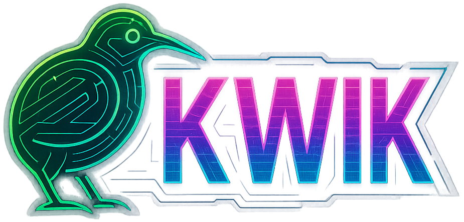
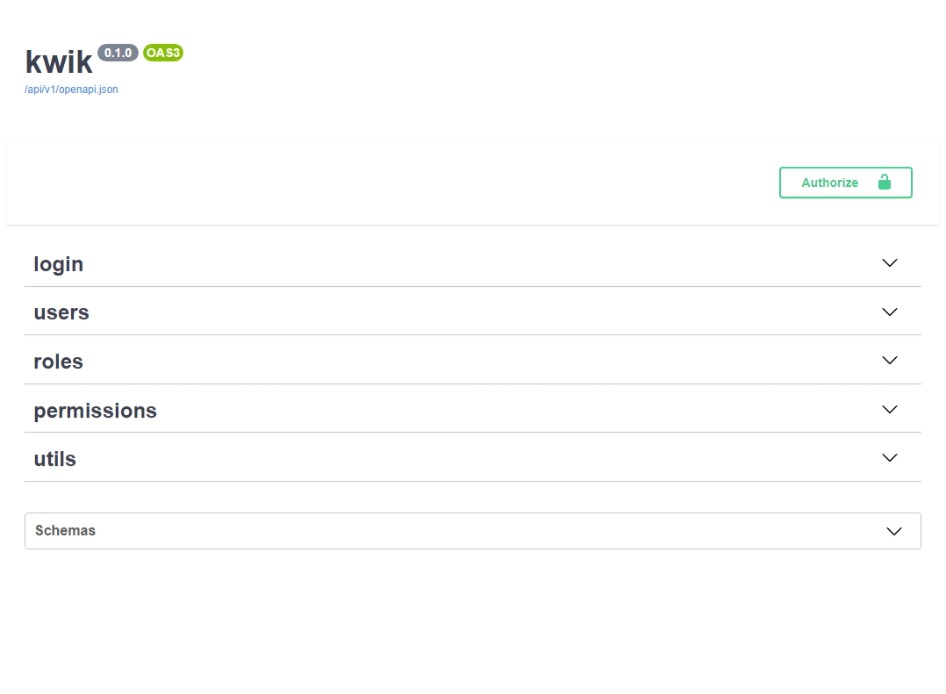

# Kwik



---

**Documentation**: https://kwik.rocks

**Repository**: https://github.com/dmezzogori/kwik

---

Kwik is a web framework for building modern, batteries-included, RESTful backends with Python 3.10+.
  Kwik is based on FastAPI, builds upon it and delivers an opinionated concise, business-oriented API.

The key features are:


* **Conciseness**: Kwik is quick (pun-intended :smile:)
* **Battle-tested**: developed internally at [Kheperer](https://kheperer.it), we use it every day to build robust and modern solutions for our customers.
* **Standards-based**

> :warning:
> While Kwik is in active development, and already used for production, it is still in a **pre-release state**.
> **The API is subject to change**, and the documentation is not complete yet.


## Acknowledgments

Python 3.10+

Kwik stands on the shoulder of a couple of giants:

* [FastAPI](https://fastapi.tiangolo.com/): for the web parts.
* [SQLAlchemy](https://www.sqlalchemy.org/): for the ORM part.

## Installation

```console
$ pip install kwik
```

It will install kwik and all its dependencies.

## Example

### Run it

```console
$ python -m kwik
```


If kwik is started in this way, it automatically creates a development server on port `8080`, with hot-reloading enabled


### Check it

Open your browser at http://localhost:8080/docs.

You will see the automatic interactive API documentation, showing the built-in endpoints and schemas.




## License

This project is licensed under the terms of the MIT license.
