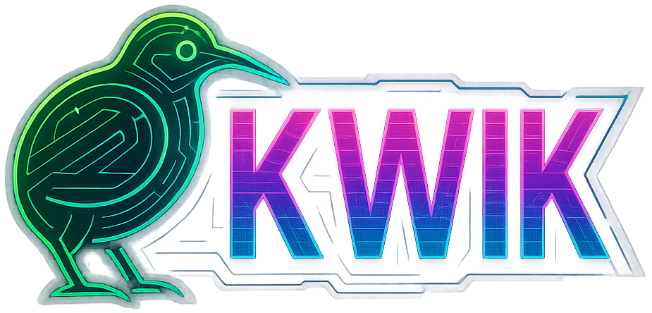

<div style="text-align: center;">

</div>

<p align="center">
    <em>Fast, batteries-included, business-oriented, opinionated REST APIs framework</em>
</p>

[](https://codecov.io/github/dmezzogori/kwik)

!!! info "Production Ready"
    
    Kwik v1.0 has been released and is ready for production use. The internal APIs, data structures, and framework interfaces are now stable. While not guaranteed, we strive to maintain backward compatibility following semantic versioning principles.

---

**Source Code**: https://github.com/dmezzogori/kwik

---

# The Business-First Python Web Framework

Kwik is a batteries-included web framework designed for developers who need to build robust, enterprise-grade backends **fast**. Built on top of FastAPI with business-oriented enhancements, Kwik strives to eliminate boilerplate and provides the patterns you need for real-world applications.

**Stop writing CRUD endpoints. Start building business logic.**

```python
# This is all you need for a complete business API
from decimal import Decimal
from pydantic import BaseModel
from sqlalchemy.orm import Mapped, mapped_column

from kwik import Kwik, api_router
from kwik.models import Base, RecordInfoMixin
from kwik.crud import AutoCRUD
from kwik.crud.context import UserCtx
from kwik.dependencies import UserContext, ListQuery, has_permission
from kwik.routers import AuthenticatedRouter
from kwik.schemas import ORMMixin, Paginated
from kwik.schemas.mixins import AtLeastOneFieldMixin
from kwik.core.enum import Permissions
from kwik.settings import BaseKwikSettings

# 1. Define the Customer model
class Customer(Base, RecordInfoMixin):
    __tablename__ = "customers"

    id: Mapped[int] = mapped_column(primary_key=True)
    name: Mapped[str] = mapped_column(nullable=False)
    email: Mapped[str] = mapped_column(unique=True, nullable=False)
    credit_limit: Mapped[Decimal] = mapped_column(default=Decimal('5000'))

# 2. Define the schemas for input/output validation
class CustomerProfile(ORMMixin):
    name: str
    email: str
    credit_limit: Decimal

class CustomerCreate(BaseModel):
    name: str
    email: str
    credit_limit: Decimal = Decimal('5000')

class CustomerUpdate(AtLeastOneFieldMixin):
    name: str | None = None
    email: str | None = None
    credit_limit: Decimal | None = None

# 3. Create CRUD operations with automatic audit trails
# AutoCRUD automatically provides: create(), create_if_not_exists(), get_multi(), get(), get_if_exist(), update(), delete()
class CustomerCRUD(AutoCRUD[UserCtx, Customer, CustomerCreate, CustomerUpdate, int]):
    pass

crud_customers = CustomerCRUD(Customer)

# 4. Create the API endpoints
# AuthenticatedRouter ensures all endpoints require JWT authentication
customers_router = AuthenticatedRouter(prefix="/customers")

# Add route-level permission dependencies as needed
@customers_router.get(
    "/", 
    response_model=Paginated[CustomerProfile],
    dependencies=(has_permission(Permissions.customers_read),)
)
def read_customers(q: ListQuery, context: UserContext):
    """Retrieve customers with pagination, filtering, and sorting."""
    total, data = crud_customers.get_multi(context=context, **q)
    return {"data": data, "total": total}

@customers_router.post(
    "/", 
    response_model=CustomerProfile,
    dependencies=(has_permission(Permissions.customers_create),)
)
def create_customer(customer_in: CustomerCreate, context: UserContext):
    """Create new customer."""
    return crud_customers.create(obj_in=customer_in, context=context)

@customers_router.get(
    "/{customer_id}", 
    response_model=CustomerProfile,
    dependencies=(has_permission(Permissions.customers_read),)
)
def read_customer(customer_id: int, context: UserContext):
    """Get a specific customer by ID."""
    return crud_customers.get_if_exist(entity_id=customer_id, context=context)

@customers_router.put(
    "/{customer_id}", 
    response_model=CustomerProfile,
    dependencies=(has_permission(Permissions.customers_update),)
)
def update_customer(customer_id: int, customer_in: CustomerUpdate, context: UserContext):
    """Update a customer."""
    return crud_customers.update(entity_id=customer_id, obj_in=customer_in, context=context)

@customers_router.delete(
    "/{customer_id}",
    dependencies=(has_permission(Permissions.customers_delete),)
)
def delete_customer(customer_id: int, context: UserContext):
    """Delete a customer."""
    crud_customers.delete(entity_id=customer_id, context=context)
    return {"message": "Customer deleted successfully"}

# 5. Register the router with your Kwik app
# Include your router into the main API router, then build the Kwik app
api_router.include_router(customers_router)
app = Kwik(settings=BaseKwikSettings(), api_router=api_router)
```

### Key Features Explained

That's it! You now have a complete REST API with:

 - **AutoCRUD**: The `AutoCRUD` class automatically provides all the standard CRUD operations (`create()`, `get_multi()`, `get_if_exist()`, `update()`, `delete()`) with built-in audit trails, validation, and business rule enforcement. You can override any method to add custom business logic while keeping the automatic features.

 - **AuthenticatedRouter**: Using `AuthenticatedRouter` instead of FastAPI's standard router automatically ensures all endpoints require JWT authentication. Users must provide a valid JWT token to access any endpoint on this router.

 - **Permission Dependencies**: The `has_permission()` dependency allows you to specify which permissions a user needs to access each endpoint. As shown in the example, you can require different permissions for different operations (`customers_read`, `customers_create`, `customers_update`, `customers_delete`). Define these names in `src/kwik/core/enum.py` under the `Permissions` enum so they can be granted to roles. You can also combine multiple permissions by passing them as separate arguments to `has_permission()`.

### ... and more:

- **Automatic AutoCRUD subclasses type-annotations** - through the use of Python generics
- **Endpoint built-in utilities** - Paginated, filterable, sortable listings (via `ListQuery`)

### Listing Queries

- Use `ListQuery` dependency to get unified list parameters: pagination, sorting, and filtering in one object.
- Query params:
  - `skip`, `limit` for pagination
  - `sorting` as comma-separated fields with optional `:asc`/`:desc` (e.g., `?sorting=name:asc,id:desc`)
  - `filter_key` and `value` for simple equality filters (e.g., `?filter_key=is_active&value=true`)
- Stable default order: when not specified, results are ordered by primary key ascending to ensure deterministic pagination.
- Invalid sort/filter fields return HTTP 400 with a clear error.
- **Automatic audit trails** - Who created/modified what and when
- **Input validation** - Business rule enforcement
- **Role-based permissions** - Resource access control


## Why Kwik?

### You're an Expert. Your Framework Should Be Too.

You've built FastAPI applications before. You know the drill: define models, write schemas, create CRUD operations, add authentication, implement permissions, set up database connections, write tests... **It's the same code, every time.**

Kwik gives you all of this **out of the box**, with patterns that scale from startup to enterprise.

### Enterprise Features That Matter

**Complete Audit System**: Every change tracked automatically with user context, timestamps, and business event logging.

**Granular Permissions**: Role-based access control with resource-level permissions and business rule enforcement.

**AutoCRUD with Intelligence**: CRUD operations that understand your business logic, not just database operations.

**Real Database Testing**: Testcontainers integration means your tests run against actual PostgreSQL, not mocks.

**Production-Ready Defaults**: Security headers, rate limiting, connection pooling, health checks, and monitoring built-in.


## Start Building, Stop Configuring

Kwik is opinionated because **you shouldn't have to make the same architectural decisions over and over again**.

**Security**: JWT authentication, RBAC permissions, audit trails, rate limiting, security headers - all configured and working.

**Database**: PostgreSQL with synchronous SQLAlchemy 2.x (async support planned), connection pooling, migrations, model mixins - all integrated.

**Testing**: Real database testing with testcontainers, user simulation, business scenario testing - all provided.

**Production**: Multi-worker deployment, health checks, metrics, logging, Docker images - all ready.

**Focus on what makes your application unique - the business logic.**

---

## Built on the Best

Kwik stands on the shoulders of giants:

* **[FastAPI](https://fastapi.tiangolo.com/)**: High-performance async web framework
* **[SQLAlchemy 2.0+](https://www.sqlalchemy.org/)**: Modern ORM with type safety
* **[Pydantic](https://docs.pydantic.dev/)**: Data validation and serialization
* **[PostgreSQL](https://www.postgresql.org/)**: Enterprise-grade database
* **[Testcontainers](https://testcontainers-python.readthedocs.io/)**: Real database testing

## Next Steps

**✅ Testing**: Real database testing with business scenarios

---

## Join the Community

**[GitHub Repository](https://github.com/dmezzogori/kwik)**: Source code, issues, and contributions

**[Documentation](https://davide.mezzogori.com/kwik/)**: Complete documentation with examples

---

*Built with ❤️ for Python developers who value productivity and code quality.*

## License

MIT License - build amazing things.

---

*Ready to build your next business API? Get started now and see why expert Python developers choose Kwik.*
